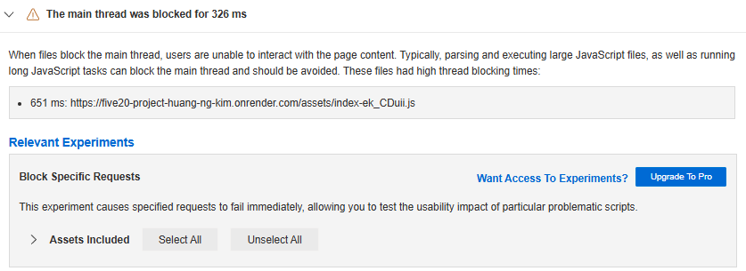
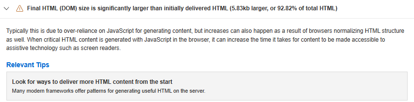
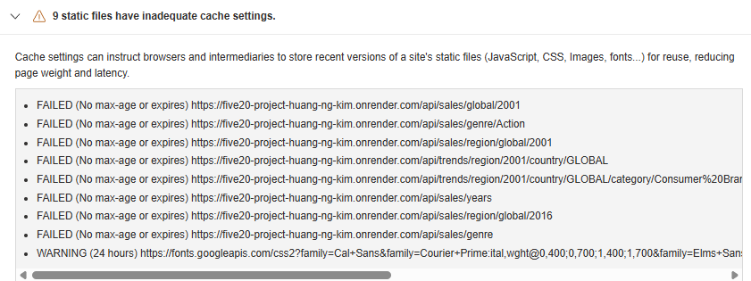

# Performance of Video Game Trends Analyzer

## Introduction and Methodology

<!-- Briefly state how you gathered data about app performance, and in what environment
(which browsers, what browser versions, what kind of device, OS,
width and height of viewport as reported in the console with `window.screen`) -->

---

## Baseline Performance

<!-- Summarize initial results for each tool that you used. Did the tools
detect all the performance issues you see as a user? -->

---

## Summary of Changes

<!-- Briefly describe each change and the impact it had on performance (be specific). If there
was no performance improvement, explain why that might be the case -->

---

### Change 1: Enable gzip compression on the Express server

Lead: Sungeun Kim

Link: <!-- gitlab url to specific lines of code -->

#### Before I make changes

- WebPageTest showed that main JS file index-ek_CDui.js blocked the main thread for 326ms and had a large transfer size. so, enabling gzip compression reduces the transfer size of this file and all other text assets, so they arrive faster and reduce the time spent before parsing and execution

#### After I make changes

...

### Change 2: Add Cache Control headers for API GET responses

Lead: Sungeun Kim

Link: <!-- gitlab url to specific lines of code -->

#### Before I make changes

- WebPageTest flagged 9 of our /api/sales/... and /api/trends/... urls with FAILED (no max-age or expires). So adding Cache Control: public, max-age=300 to all API GET responses directly fixes this issue and lets the browser cache our read only JSON data

#### After I make changes

---

## Conclusion

<!-- Summarize which changes had the greatest impact, note any surprising results and list 2-3 main
things you learned from this experience. -->
