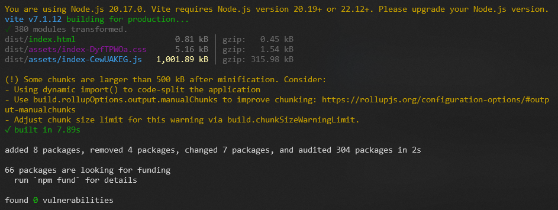
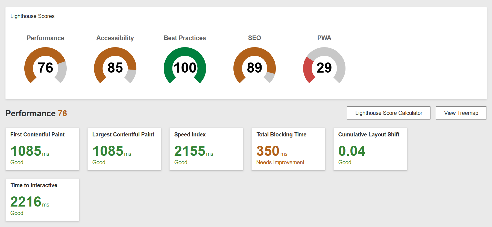

# Performance of Video Game Trends Analyzer

## Introduction and Methodology

<!-- Briefly state how you gathered data about app performance, and in what environment
(which browsers, what browser versions, what kind of device, OS,
width and height of viewport as reported in the console with `window.screen`) -->

For measuring the performance of our site, we mostly used WebPageTest's Instant Test on the Render deployment of our site, testing both Site Performance and doing the Lighthouse test. We also looked at the network tab of the inspector to check how long requests took and if things were being cached. The width and height of the viewport is 1920 x 1080.

Yan Chi: I used Google Chrome version 142.0.7444.176 on my Windows 10 desktop.
Sungeun: I used Google Chrome version 142.0.7444.176 on my Windows 10 desktop
Jennifer: Firefox (ver. 145.0.1) & Google Chrome (ver. 142.0.7444.176) on Windows 11 desktop
---

## Baseline Performance

<!-- Summarize initial results for each tool that you used. Did the tools
detect all the performance issues you see as a user? -->

In the initial test for our application, we got a pretty good score on both Page Performance and the Lighthouse report, though there was defintely places that we could have improved on.

In particular, we had some issues with render blocking from external CSS files, which we later found out had to do with the use of Google Fonts. We also saw an issue that stated our final HTML size was much larger than the initial delivered HTML, but that was because of us using React. There were also some accessibility changes we could make, such as adding labels to select tags and changing some of the colour contrast.

## Summary of Changes

<!-- Briefly describe each change and the impact it had on performance (be specific). If there
was no performance improvement, explain why that might be the case -->

### Change 1: Enable gzip compression on the Express server

Lead: Sungeun Kim

Link:

[Imported the compression & Enable gzip compression](https://gitlab.com/dawson-cst-cohort-2026/520/section2/teams/TeamL-23-JenSungeunYanChi/520-project-huang-ng-kim/-/blob/PerformanceImprovements/Video_Game_Trends_Analyzer_Project/server/app.js?ref_type=heads#L2)

#### Before I make changes

WebPageTest showed that main JS file index-ek_CDui.js blocked the main thread for 326ms and had a large transfer size. so, enabling gzip compression reduces the transfer size of this file and all other text assets, so they arrive faster and reduce the time spent before parsing and execution

#### After I make changes

- I tested the Render deployment using chrome devtool. On larger api responses, the Content-Encoding header now appears with the value br. This means the response is being compressed before it is sent to the browser. both br (Brotli) and gzip are supported, so seeing Content-Encoding: br confirms that the Express compression middleware is working correctly.

...

### Change 2: Add Cache Control headers for API GET responses

Lead: Sungeun Kim

Link:

[Add Cache Control headers for API GET responses](https://gitlab.com/dawson-cst-cohort-2026/520/section2/teams/TeamL-23-JenSungeunYanChi/520-project-huang-ng-kim/-/blob/PerformanceImprovements/Video_Game_Trends_Analyzer_Project/server/app.js?ref_type=heads#L35)

#### Before I make changes

WebPageTest flagged 9 of our /api/sales/... and /api/trends/... urls with FAILED (no max-age or expires). So adding Cache Control: public, max-age=300 to all API GET responses directly fixes this issue and lets the browser cache our read only JSON data

#### After I make changes

- I tested the Render deployment using chrome devtool. I also checked the Response Headers of the same api request on the deployed site. The response now includes Cache-Control: max-age=300. This shows that middleware is correctly setting the caching on all /api/.. GET responses in production. On a second reload, chrome serves some of these requests from disk or memory cache, confirming that the browser is reusing the json

---

### Change 3: Add server-side memory caching

Lead: Yan Chi Ng

Link:

[Add server-side caching for sales routes](https://gitlab.com/dawson-cst-cohort-2026/520/section2/teams/TeamL-23-JenSungeunYanChi/520-project-huang-ng-kim/-/blob/PerformanceImprovements/Video_Game_Trends_Analyzer_Project/server/routers/sales.js#L31)

[Add server-side caching for trends routes](https://gitlab.com/dawson-cst-cohort-2026/520/section2/teams/TeamL-23-JenSungeunYanChi/520-project-huang-ng-kim/-/blob/PerformanceImprovements/Video_Game_Trends_Analyzer_Project/server/routers/trends.js#L48)

#### Before I make changes

- When looking in our network tab, we saw that after changing the year, it took almost half a second to fetch the data from our api, which was quite slow, and may affect the user's experience. There was also no caching on the server-side, so the data from a previously selected year had to be re-fetched.

#### After I make changes

- After adding server-side caching in our express routes, after choosing a category that had previously been selected, it fetches it from memory, reducing database hits and also speeding up requests significantly. 

...

### Change 4: Add indexes to database collection

Lead: Yan Chi Ng

Link:

[Add indexing to common database queries](https://gitlab.com/dawson-cst-cohort-2026/520/section2/teams/TeamL-23-JenSungeunYanChi/520-project-huang-ng-kim/-/blob/PerformanceImprovements/Video_Game_Trends_Analyzer_Project/server/utils/seed.js#L37)

#### Before I make changes

- Before adding indexes to the database collection, it took quite a long time for certain requests, like getting all years, to respond, since two collections had to be queried. Overall a lot of queries that involved not just one field took ~100 ms. 

#### After I make changes

- I was quite surprised to find that indexes made a massive difference in speeding up requests--the years request that before took around 100ms now only took 3-4ms, which is significantly quicker. Pretty much every request across the board became faster, since I added indexes to the most common queries that most db functions use. 

---

### Change 5: Preconnect to Google Fonts

> Lead: Jennifer Huang
> 
> Link: [Preconnect to Google Fonts](https://gitlab.com/dawson-cst-cohort-2026/520/section2/teams/TeamL-23-JenSungeunYanChi/520-project-huang-ng-kim/-/blame/staging/Video_Game_Trends_Analyzer_Project/client/index.html?ref_type=heads#L6)

#### Before:

- Loading static file were taking longer because it would download the fonts after it sees the imports in CSS files. This makes the loading speed of he webpage slower. Both FCP & LCP was 1384ms. I found the preconnect links on Google font 'embed code' section and added that to the `index.html` and removed the import statements.

#### After:
- Both metrics went down however now the tag `<link href="https://fonts.googleapis.com/...` is causing it to block rendering, I plan to divide the fonts up into mutilple `<link>` statements and preload one of them.

---

### Change 6: Lazy Loading Map & Line Chart

> Lead: Jennifer Huang
> 
> Links: 
> 1. [Lazy Loading Map Charts](https://gitlab.com/dawson-cst-cohort-2026/520/section2/teams/TeamL-23-JenSungeunYanChi/520-project-huang-ng-kim/-/blame/staging/Video_Game_Trends_Analyzer_Project/client/src/components/View2.jsx?ref_type=heads#L15)
> 2. [Add Suspense](https://gitlab.com/dawson-cst-cohort-2026/520/section2/teams/TeamL-23-JenSungeunYanChi/520-project-huang-ng-kim/-/blame/staging/Video_Game_Trends_Analyzer_Project/client/src/components/View2.jsx?ref_type=heads#L162)
> 3. [Lazy Loading Line Charts](https://gitlab.com/dawson-cst-cohort-2026/520/section2/teams/TeamL-23-JenSungeunYanChi/520-project-huang-ng-kim/-/blame/staging/Video_Game_Trends_Analyzer_Project/client/src/components/View3.jsx?ref_type=heads#L15)
> 

#### Before:

- The Javascript bundlesizes are large, mainly because of amChart's modules (like geodata). The bundlesize for the index.js script (with gzip) was 315kB. The TBT was 399ms and LCP was 1384ms. I lazy-loaded charts that were below the fold like Map & Line Chart. If the charts were not finished loading I used `<Suspense>` to create a loading screen as a fallback component.

#### After:

> These are the results after preconnecting fonts and lazy-loading.
> **Also want to note that this is after the design has been implemented fully.**

- The TBT went from 399 down to 350ms, and LCP went from 1384 to 1085ms. Also the bundles are now separated into smaller chunks, so now the initial load is faster.

## Conclusion

<!-- Summarize which changes had the greatest impact, note any surprising results and list 2-3 main
things you learned from this experience. -->

Overall, the changes that had the biggest impact on our performance were adding indexes to the database as well as lazy loading the charts that were below the fold, at least from what we tested from localhost. However, they didn't seem to have a big impact on the performance when deployed to Render, which is something we didn't expect. We also expected further performance enhancements from adding cache-control headers and compression, but they didn't really affect the score we got from WebPageTest. 

We learned that optimization is actually not too hard to implement, a lot of these changes were a few lines of code, so there's not really an excuse to not prioritize user experience.

We also learned that, though some of these optimizations might not have changed much in terms of performance individually, when there are multiple the improvements do add up. When we first implemented the map chart, it would take a long time to fetch all of the data needed for the years and the categories, but with each change we made, it ran faster and faster, which was cool to see. 