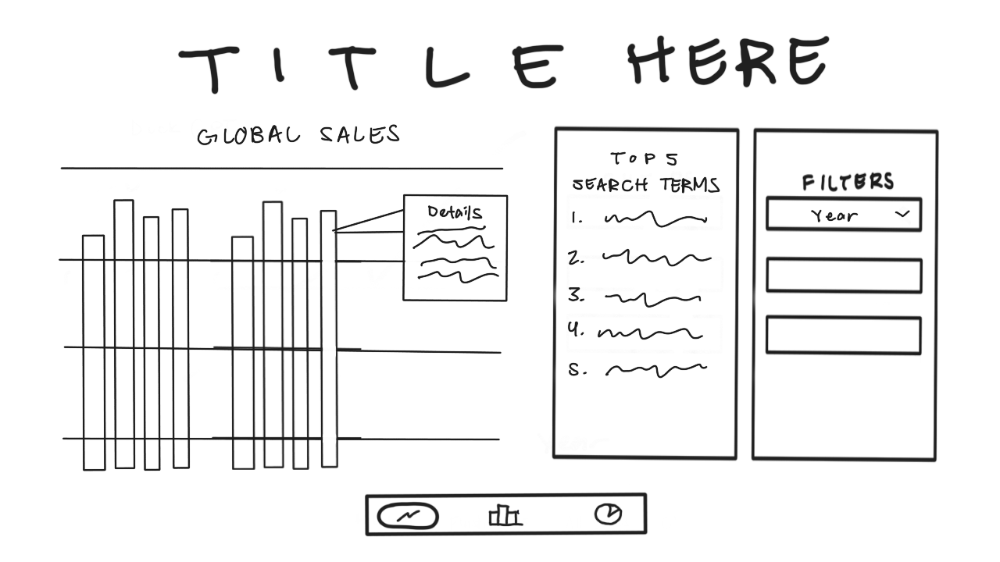
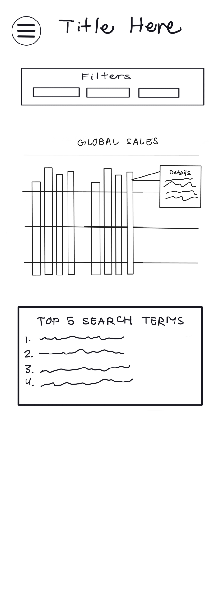
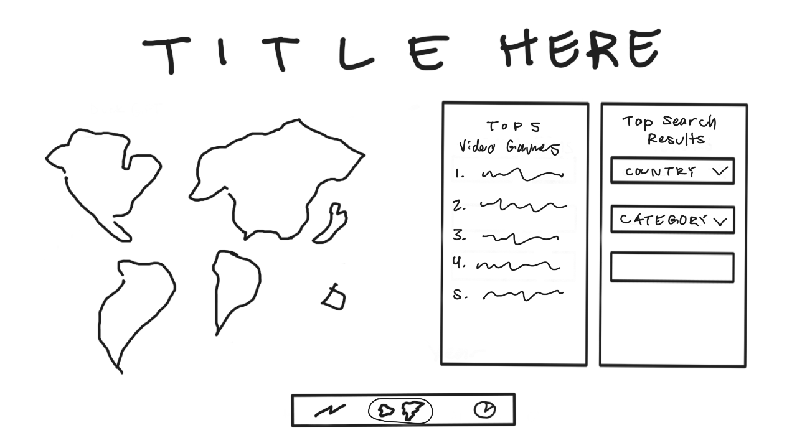
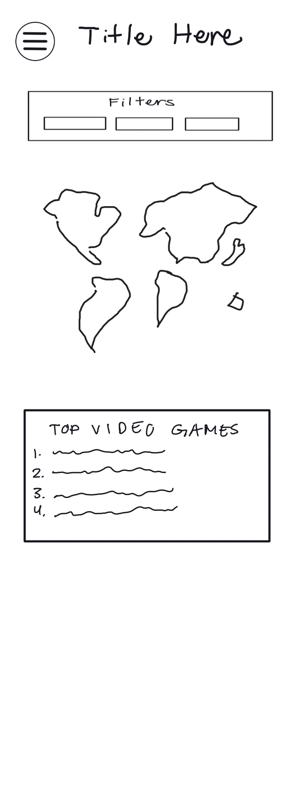
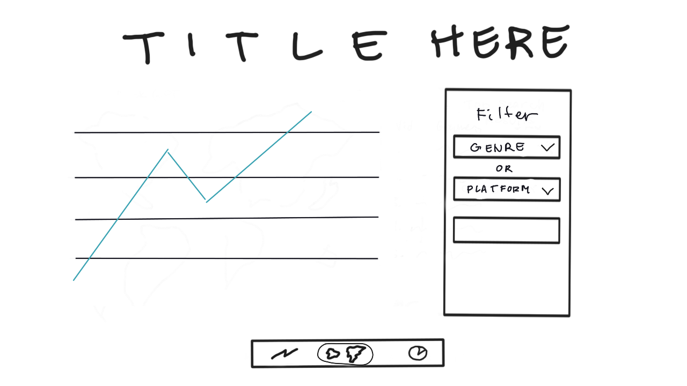

# Video Game Trends Analyzer

## Data

**Choose Data issue:** [issue:1](https://gitlab.com/dawson-cst-cohort-2026/520/section2/teams/TeamL-23-JenSungeunYanChi/520-project-huang-ng-kim/-/issues/1)

**Summary:** We will explore the relationship between public online interest and real world sales of video games by combining two open Kaggle datasets:

- Video Game Sales : a dataset of games with over 100,000 copies sold, including title, genre, platform, publisher, year, and regional/global sales.
- Google Trends Dataset : search interest data for popular queries across years and regions

- We will analyze how search popularity (Google Trends) correlates with game sales across genres, years, and platforms.

## API

- We will define three Express endpoints:

1. **GET /sales/global**

   - Returns aggregated global sales per year and genre
   - Response: [{ year, genre, global_sales }]
   - Server : Reads and filters vgsales.csv, sums sales grouped by year and genre

2. **GET /sales/region/:region**

   - Returns region specific sales for the given region. For example, NA, EU, JP
   - Params will be used: region
   - Response: [{ year, genre, sales }]
   - Server : Filters dataset by region and aggregates sales by genre and year

3. **GET /trends/:genre**
   - Returns average yearly Google Trends interest for a given game genre.
   - Params will be used: genre
   - Response: [{ year, avg_interest }]
   - Server : Reads trends.csv, filters by matching genre keyword, averages yearly interest values

## Visualizations

Video game sales are compared to the most common Google search terms of the same year. We want to see if public interest of the game correlates to actual sales. We also want to see how different game genres sell overtime; does world-wide trends affect game trends?

## Views

### View 1: Bar Chart

- Above the fold: bar chart of video games displayed and list of most searched terms on Google. Data here are all global and not pertain to a specific region/country.
- Hidden: popup windows displaying details on each video game (bar on the chart).

### View 2: Map

- Above the fold: display map of the world. Only certain regions are clickable.
- After clicking on a region: more windows will pop up with a 'Top Video Games' chart and a filter to find which search terms are trending in a specific country.

### View 3: Game Genre Trends

- Above the fold: line chart displaying sales of a game genre over time.
- Hover over a specific point in the line graph to see more details.

## Functionality

- Filters? ex, region, years

## Features and Priorities

**Top Priority: (P0)**
- Display top global video games sales as a bar chart in view 1
- Display top search terms of a certain year (in all views)
- Display top global video games sales of a certain region (NA, EU, JP, Other) in view 2
- Dropdown menu to select country based on selected region in view 2, which will display the top search terms of that country
- Display global sales of a specific genre or platform over time as a line chart in view 3
- Navigation bar on bottom of app to switch between views
- Adaptive mobile layout for each view

**Middle Priority: (P1)**
- World Map visualization of sales data per region in view 2
- Dropdown menu to filter each country's top search results by category in view 2

**Least Priority: (P2)** 
- Hover popup that displays game details on bar graph screen in view 1
- Clickable popup on world map screen in view 2, windows display permanently on the side to choose region/country
- Hover popup on line graph screen in view 3, windows display permanently on the side that shows most sold games of that genre/platform of that point (year)

## Dependencies
- We will use Chart.js to display visualizations of data, as it was recommended in the project overview, and it seems easy and intuitive to use. 
- We will use a bar chart: https://www.chartjs.org/docs/latest/charts/bar.html 
- and also a line chart: https://www.chartjs.org/docs/latest/charts/line.html 

- We will also use amCharts to display the visualization of the world map, since it seems very comprehensive and there are good examples on the website that fit our needs, including hoverable popups for each country, as well as a toggle between a flat 2d map and a 3d globe: https://www.amcharts.com/demos/trumps-reciprocal-tariffs-map/
